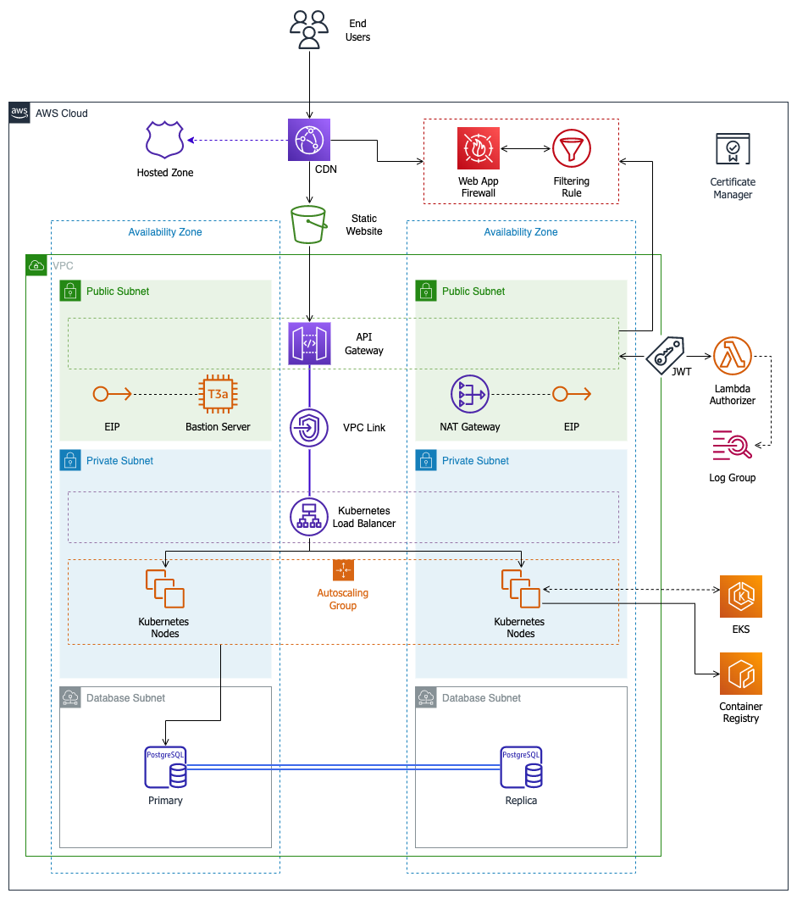

# AWS Microservices Basic Architecture Terraform Module

Terraform module, which creates all basic but needed resources to create a microservices architecture in AWS, where it is common to identify these layers:    
- Frontend, where the end user is able to interact and request data coming from the architecture backbone
- Access (Traffic Gateway), which will control the incoming traffic and also expose backend functionalities in the form of HTTP APIs. 
- Backend, in charge of holding and managing the software runtime components.
- Registry, where the business logic is stored in the form of container images.
- Storage, responsible of managing the data handled by the solution.
- Networking, foundation of the architecture where components are placed.   

## Reference Architecture

The components provisioned with this module could be represented with the following architecture diagram:



### Networking

The foundation layer of the solucion is placed under:

- `Single VPC` with a provided CIDR
- `6 subnets` located in 2 different AZ (availability zones)
    - 2 public subnets
    - 2 private subnets
    - 2 database subnets (also private)
- `Single NAT Gateway` with an external `associated Elastic IP`
- `Security groups` to allow both http and https inbound traffic
- An **optional** `Virtual Private Gateway` (when there is a need of a Site-to-Site VPN)

### Runtime

The backbone runtime layer basically consists in a full ready-to-use EKS cluster with:

- AWS managed control plane with a provided version exposing a public endpoint (for using kubectl)
- `EKS Managed Node Group`
    - Fully-private (located in private subnets)
    - Max size is variable
    - Support for Amazon Linux 2 EKS Optimized AMI and Bottlerocket nodes
    - Instance classes and disk size provided by the user
    - User-managed SSH key pairs for accesing nodes with corresponding security group
- `User managed cluster auth` (IAM roles, accounts and groups can be mapped in there)
- AWS EKS Cluster Addons
    - [CoreDNS](https://docs.aws.amazon.com/eks/latest/userguide/managing-coredns.html)
    - [Kube-proxy](https://kubernetes.io/docs/reference/command-line-tools-reference/kube-proxy/)
    - [VPC-CNI](https://github.com/aws/amazon-vpc-cni-k8s)
    - [eks-cluster-autoscaler](https://aws.github.io/aws-eks-best-practices/cluster-autoscaling/)
    - [eks-load-balancer-controller](https://kubernetes-sigs.github.io/aws-load-balancer-controller/)
    - [eks-ack-addons](https://aws-controllers-k8s.github.io/community/docs/community/overview/)
- AWS EKS Identity Provider Configuration
- `Nginx` deployed as Ingress Controller (which generates an AWS ALB on its behalf)

There is an adittional resource in charge of creating an EC2 instance known as `bastion server`, which is located in a public subnet and allows to jump to internal resources (databases, services, etc).

### Registry

Every time there are containers involved in a solution, there should be a container registry in charge of storing and versioning the images with the packaged application source code to be deployed.

Users can provide a list of repositories to create and a list of tags to preserve from expiration/deletion.

### Storage

The storage consists of a single `database instance`, which could be a Postgres or Mysql instance.

There is an option to enable replication to create a `multi-az deployment` with a primary and a replica instance.

As the cost was an important driver when creating this module, there is **no support for Aurora instances**, so these are `regular Postgres/MySQL engines` managed by AWS.

Users should provide:
- DB Engine / Engine Family
- Instance Class
- Allocated Storage 
- Custom username
- Enable/disable cloudwatch logging

### Traffic

Access traffic layer allows the frontend to communicate with the backend runtime infrastructure. To so do, it creates several components that act as a bridge between public traffic and private resources, like the EKS Cluster.

- `API Gateway` resources
  - A main API with 2 **optional** default routes (secured/unsecured)
  - An **optional** custom authorizer with validates JWT in secured requests
  - An **optional** default stage with auto-deploy
  - A custom domain name to access APIs 
- `VPC Link` acting as an edge component in the private side of the network, which allow connectivy from API Gateway and proxy it to the EKS ALB.
- `Lambda function` created from a source code package located in an existing S3 bucket, which acts as the authorizer responsible for allowing/denying access to APIs.
- Main `AWS managed Certificate` to enable HTTPS-only traffic and terminate TLS handshake in API Gateway.
- Route53 record to point to API custom domain.

### Frontend

The frontend represents a `static website` hold in an `S3 bucket`, with a `Cloudfront Distribution` upfront for performance related concerns (low latency, edge caching, content delivery, etc).

There is an additional `CDN with S3 configured for redirection`, in case somebody tries to access with _www._ subdomain, so it's redirected to root domain.

Both CDN have an `associated Route53 records` so URLs are routable through an user-friendly domain pre-configured by the company.

## Usage

### Prerequisites

- Create an AWS account and populate a user with `AdministratorAccess` IAM role. If you want to control roles more granularly, it's up to you specifying needed roles to create the resources involved in this module.

- Get user console and programatic access credentials and set them up in your local environment. See [Configuring AWS CLI](https://docs.aws.amazon.com/cli/latest/userguide/getting-started-quickstart.html) for more details. 

- Download needed tooling (AWS CLI, Terraform CLI)

- Create an S3 bucket to store infrastructure state, and place it under terraform backend configuration:

```hcl
backend "s3" {
  bucket = "mycompany-infra-state"      # <= Bucket name
  key = "microservices-basic.tfstate"   # <= Where to store infra manifests within the bucket
  region = "nowhere-region"             # <= AWS Region
  profile = "my-cool-profile"           # <= (optional) specific AWS profile to use
}
```

- It's assumed that the company **already has a Route53 zone** configured in AWS, as sometimes this task is performed when a domain is being acquired or transferred from some other DNS service.

### Module Instantiation

- Create a `main.tf` file with the module definition with custom variables depending on your needs:

```hcl
module "microservices_architecture_basic" {
    
  source = "git@github.com:ingeniala/terraform-aws-microservices-basic.git"

  # Check needed input variables 
}
```

- It's advisable to work with [Terraform workspaces](https://developer.hashicorp.com/terraform/language/state/workspaces) to isolate infra environments and states. For example switching to a newly created dev environment:

```bash
terraform workspace new dev
```

- Done! Initialize module and then plan and apply the infra changes

```bash
terraform init

terraform plan -out=my-cool-plan.out

terraform apply "my-cool-plan.out"
```

## Examples

- [Basic](https://github.com/ingeniala/terraform-aws-microservices-basic/tree/main/examples/basic): Basic setup for a regular non-production environment. 

## Contributing

We are grateful to the community for contributing bugfixes and improvements! Please see below to learn how you can take part.

- [Code of Conduct](https://github.com/ingeniala/terraform-aws-microservices-basic/blob/main/CODE_OF_CONDUCT.md)
- [Contributing Guide](https://github.com/ingeniala/terraform-aws-microservices-basic/blob/main/CONTRIBUTING.md)

## Requirements

| Name | Version |
|------|---------|
| `terraform` | >= 1.0 |

## Providers

| Name | Version |
|------|---------|
| [aws](https://registry.terraform.io/providers/hashicorp/aws/latest/docs) | >= 4.0 |
| [kubernetes](https://registry.terraform.io/providers/hashicorp/kubernetes/latest) | >= 2.10 |
| [helm](https://registry.terraform.io/providers/hashicorp/helm/latest) | >= 2.6.0 |

## Modules

| Name | Source | Version |
|------|--------|---------|
| `networking_vpc` | [terraform-aws-modules/vpc/aws](https://registry.terraform.io/modules/terraform-aws-modules/vpc/aws/latest) | ~> 4.0 |
| `runtime_eks` | [terraform-aws-modules/eks/aws](https://registry.terraform.io/modules/terraform-aws-modules/eks/aws/latest) | ~> 19.13 |
| `runtime_eks_key_pair` | [terraform-aws-modules/key-pair/aws](https://registry.terraform.io/modules/terraform-aws-modules/key-pair/aws/latest) | ~> 2.0 |
| `runtime_eks_cluster_autoscaler` | [lablabs/eks-cluster-autoscaler/aws](https://registry.terraform.io/modules/lablabs/eks-cluster-autoscaler/aws/latest) | 2.1.0 |
| `runtime_eks_load_balancer_controller` | [lablabs/eks-load-balancer-controller/aws](https://registry.terraform.io/modules/lablabs/eks-load-balancer-controller/aws/latest) | 1.2.0 |
| `runtime_eks_ack_addons` | [aws-ia/eks-ack-addons/aws](https://registry.terraform.io/modules/aws-ia/eks-ack-addons/aws/latest) | 1.3.0 |
| `runtime_eks_nginx_ingress_controller` | [lablabs/eks-ingress-nginx/aws](https://registry.terraform.io/modules/lablabs/eks-ingress-nginx/aws/latest) | 1.2.0 |
| `runtime_bastion_key_pair` | [terraform-aws-modules/key-pair/aws](https://registry.terraform.io/modules/terraform-aws-modules/key-pair/aws/latest) | ~> 2.0 |
| `runtime_bastion` | [cloudposse/ec2-bastion-server/aws](https://registry.terraform.io/modules/cloudposse/ec2-bastion-server/aws/latest) | ~> 0.30 |
| `registry_ecr` | [cloudposse/ecr/aws](https://registry.terraform.io/modules/cloudposse/ecr/aws/latest) | ~> 0.35 |
| `storage_database_master` | [terraform-aws-modules/rds/aws](https://registry.terraform.io/modules/terraform-aws-modules/rds/aws/latest) | 5.6.0 |
| `storage_database_replica` | [terraform-aws-modules/rds/aws](https://registry.terraform.io/modules/terraform-aws-modules/rds/aws/latest) | 5.6.0 |
| `storage_database_security_group` | [terraform-aws-modules/security-group/aws](https://registry.terraform.io/modules/terraform-aws-modules/security-group/aws/latest) | ~> 4.0 |
| `traffic_api_gateway` | [terraform-aws-modules/apigateway-v2/aws](https://registry.terraform.io/modules/terraform-aws-modules/apigateway-v2/aws/latest) | ~> 2.2 |
| `traffic_api_gateway_security_group` | [terraform-aws-modules/security-group/aws](https://registry.terraform.io/modules/terraform-aws-modules/security-group/aws/latest) | ~> 4.0 |
| `traffic_lambda_authorizer` | [terraform-aws-modules/lambda/aws](https://registry.terraform.io/modules/terraform-aws-modules/lambda/aws/latest) | ~> 4.16 |
| `traffic_main_certificate` | [terraform-aws-modules/acm/aws](https://registry.terraform.io/modules/terraform-aws-modules/acm/aws/latest) | ~> 4.3 |
| `frontend_root_cdn` | [terraform-aws-modules/cloudfront/aws](https://registry.terraform.io/modules/terraform-aws-modules/cloudfront/aws/latest) | ~> 3.2 |
| `frontend_www_cdn` | [terraform-aws-modules/cloudfront/aws](https://registry.terraform.io/modules/terraform-aws-modules/cloudfront/aws/latest) | ~> 3.2 |

## Resources

| Name | Type | 
|------|------|
| `aws_eip.nat_eip` | resource |
| `aws_security_group.vpc_tls` | resource |
| `aws_security_group.vpc_http` | resource |
| `aws_security_group.eks_node_remote_ssh_access` | resource |
| `aws_iam_policy.eks_node_additional_policy` | resource |
| `aws_ecrpublic_authorization_token.ecr_public_auth_token` | datasource |
| `aws_ami.amazon_linux_2` | datasource |
| `aws_availability_zones.available` | datasource |
| `aws_db_subnet_group.db_subnet_group` | resource |
| `aws_route53_zone.main` | datasource |
| `aws_route53_record.apigw_record` | resource |
| `aws_lb.eks_alb` | datasource |
| `aws_lb_listener.eks_alb_http` | datasource |
| `aws_s3_bucket.root_website_bucket` | resource |
| `aws_s3_bucket_policy.root_website_bucket_policy` | resource |
| `aws_iam_policy_document.root_website_bucket_policy_document` | datasource |
| `aws_s3_bucket_cors_configuration.root_website_bucket_cors` | resource |
| `aws_s3_bucket_website_configuration.root_website_bucket_config` | resource |
| `aws_s3_bucket_ownership_controls.root_website_bucket_ownership` | resource |
| `aws_s3_bucket_public_access_block.root_website_bucket_access` | resource |
| `aws_s3_bucket_acl.root_website_bucket_acl` | resource |
| `aws_route53_record.root_website_record` | resource |
| `aws_s3_bucket.www_website_bucket` | resource |
| `aws_s3_bucket_policy.www_website_bucket_policy` | resource |
| `aws_iam_policy_document.www_website_bucket_policy_document` | datasource |
| `aws_s3_bucket_website_configuration.www_website_bucket_config` | resource |
| `aws_s3_bucket_ownership_controls.www_website_bucket_ownership` | resource |
| `aws_s3_bucket_public_access_block.www_website_bucket_access` | resource |
| `aws_s3_bucket_acl.www_website_bucket_acl` | resource |
| `aws_route53_record.www_website_record` | resource |

## Inputs

| Name | Description | Type | Default | Required |
|------|-------------|------|---------|:--------:|
| `env` | Environment name | `string` | null | yes |
| `project` | Project name | `string` | null | yes |
| `aws_profile` | AWS Profile to use when interacting with resources during installation | `string` | null | yes |
| `vpc_cidr_block` | CIDR block for VPC | `string` | null | yes |
| `vpc_subnet_extra_mask_bits` | Extra mask bits amount for performing subnetting within the VPC | `number` | null | yes |
| `vpc_enable_vpn` | Whether to enable a Virtual Private Network Gateway attached to the VPC | `bool` | false | no |
| `eks_cluster_version` | EKS Cluster version to be set | `string` | null | yes |
| `eks_cluster_max_size` | EKS Cluster maximum amount of worker nodes | `number` | null | yes |
| `eks_cluster_auth_map_roles` | Additional IAM roles to add to the aws-auth configmap. | `list(object)` | [{}] | no |
| `eks_cluster_auth_map_users` | Additional IAM users to add to the aws-auth configmap. | `list(object)` | [{}] | no |
| `eks_cluster_auth_map_accounts` | Additional IAM accounts to add to the aws-auth configmap. | `list(object)` | [{}] | no |
| `eks_cluster_node_group_instance_types` | EKS Cluster Main Node group instance types | `list(string)` | null | yes |
| `eks_cluster_node_group_ami` | EKS Cluster Main Node group AMI machine | `string` | BOTTLEROCKET_x86_64 | no |
| `eks_cluster_node_group_platform` | EKS Cluster Main Node group platform | `string` | bottlerocket | no |
| `eks_cluster_node_group_capacity` | EKS Cluster Main Node group capacity type | `string` | ON_DEMAND | no |
| `eks_cluster_node_group_disk_size` | EKS Cluster Main Node group disk size, described in Gigabytes | `number` | null | yes |
| `eks_addon_aws_lb_version` | EKS Cluster AWS Load Balancer Controller Addon Version | `string` | null | yes |
| `eks_addon_autoscaler_version` | EKS Cluster Autoscaler Addon Version | `string` | null | yes |
| `eks_addon_ack_apigw2_version` | EKS ACK Addon for ApiGatewayv2 Version | `string` | null | yes |
| `eks_ingress_controller_version` | EKS Nginx Ingress Controller Version | `string` | null | yes |
| `bastion_instance_class` | Bastion server instance class | `string` | null | yes |
| `bastion_public_visible` | Whether to associate a public EIP to Bastion server | `bool` | true | no |
| `registry_repositories` | List of repositories to create in ECR | `list(string)` | null | yes |
| `registry_protected_tags` | List of ECR protected tags which won't never be expired on any repository. | `list(string)` | [] | no |
| `registry_full_access_users` | List of users with full access privileges to ECR. | `list(string)` | [] | no |
| `database_port` | Database Instance Port to be set | `number` | null | yes |
| `database_user` | Database user to be set | `string` | null | yes |
| `database_engine` | Database engine to be set | `string` | null | yes |
| `database_engine_version` | Database engine version to be set | `string` | null | yes |
| `database_replication_enabled` | Whether to enable replication mode | `bool` | false | no |
| `database_instance_type` | Instace type to use for the database | `string` | null | yes |
| `database_allocated_storage` | Instance allocated storage | `number` | null | yes |
| `database_max_allocated_storage` | Instance maximum allocated storage | `number` | null | yes |
| `database_enable_cloudwatch_logging` | Whether to enable cloudwatch log group creation | `bool` | false | no |
| `database_cloudwatch_logging_exports` | What to export to cloudwatch log group | `list(string)` | [] | no |
| `database_backup_retention_period` | Database backup retention period | `number` | 1 | no |
| `traffic_main_domain_name` | Main domain name managed by AWS of the solution | `string` | null | yes |
| `traffic_apigw_domain_name` | Domain name managed by AWS and used for exposing services within the API Gateway | `string` | null | yes |
| `traffic_apigw_api_version` | API Version to set | `string` | stable | no |
| `traffic_create_api_stage` | Whether to create default stage to publish API | `bool` | false | no |
| `traffic_create_api_routes` | Whether to create routes and integrations | `bool` | false | no |
| `traffic_create_api_lambda_authorizer` | Whether to create lambda authorizers to enable API authentication | `bool` | false | no |
| `traffic_api_authorizer_bucket_name` | S3 bucket name where the package to create lambda authorizer is located | `string` | null | no |
| `traffic_api_authorizer_bucket_key` |S3 bucket key where the package to create lambda authorizer is located | `string` | null | no |
| `traffic_api_authorizer_runtime` | Lambda authorizer software runtime to be defined | `string` | null | no |
| `traffic_api_authorizer_env_vars` | Lambda authorizer environment variables to be defined | `map(string)` | {} | no |
| `traffic_api_request_mappings` | Mappings applied to request parameters that the API Gateway should perform | `map(string)` | {} | no |
| `traffic_api_response_mappings` | Mappings applied to response parameters that the API Gateway should perform | `map(string)` | {} | no |
| `traffic_certificate_subjective_names` | List of subjective names to include in the main ACM | `list(string)` | null | yes |
| `frontend_subdomain` | Frontend subdomain to configure in Route53 and CDN distribution | `string` | null | yes |

## Outputs

| Name | Description | 
|------|------|
| `networking_vpc_id` | The ID of the VPC |
| `networking_vpc_cidr_block` | The CIDR block of the VPC |
| `networking_default_security_group_id` | The ID of the security group created by default on VPC creation |
| `networking_private_subnets` | List of IDs of private subnets |
| `networking_private_subnets_cidr_blocks` | List of CIDR blocks of private subnets |
| `networking_private_route_table_ids` | List of IDs of private route tables |
| `networking_public_subnets` | List of IDs of public subnets |
| `networking_public_subnets_cidr_blocks` | List of CIDR blocks of public subnets |
| `networking_public_route_table_ids` | List of IDs of public route tables |
| `networking_database_subnets` | List of IDs of database subnets |
| `networking_database_subnets_cidr_blocks` | List of cidr_blocks of database subnets |
| `networking_database_route_table_ids` | List of IDs of database route tables |
| `networking_nat_ids` | List of allocation ID of Elastic IPs created for AWS NAT Gateway |
| `networking_nat_public_ips` | List of public Elastic IPs created for AWS NAT Gateway |
| `networking_natgw_ids` | List of NAT Gateway IDs |
| `networking_igw_id` | The ID of the Internet Gateway |
| `networking_vgw_id` | The ID of the VPN Gateway. Will remain empty if VPN is disabled |
| `runtime_eks_cluster_arn` | The Amazon Resource Name (ARN) of the EKS cluster |
| `runtime_eks_cluster_certificate_authority_data` | Base64 encoded certificate data required to communicate with the cluster |
| `runtime_eks_cluster_endpoint` | Endpoint for your Kubernetes API server |
| `runtime_eks_cluster_id` | The ID of the EKS cluster. Note: currently a value is returned only for local EKS clusters created on Outposts |
| `runtime_eks_cluster_name` | The name of the EKS cluster |
| `runtime_eks_cluster_oidc_issuer_url` | The URL on the EKS cluster for the OpenID Connect identity provider |
| `runtime_eks_cluster_platform_version` | Platform version for the cluster |
| `runtime_eks_cluster_status` | Status of the EKS cluster. One of `CREATING`, `ACTIVE`, `DELETING`, `FAILED` |
| `runtime_eks_cluster_primary_security_group_id` | Cluster security group that was created by Amazon EKS for the cluster. Managed node groups use this security group for control-plane-to-data-plane communication. Referred to as 'Cluster security group' in the EKS console |
| `runtime_eks_cluster_addons` | Map of attribute maps for all EKS cluster addons enabled |
| `runtime_eks_eks_managed_node_groups` | Map of attribute maps for all EKS managed node groups created |
| `runtime_eks_eks_managed_node_groups_autoscaling_group_names` | List of the autoscaling group names created by EKS managed node groups |
| `runtime_eks_aws_auth_configmap_yaml` | Formatted yaml output for base aws-auth configmap containing roles used in cluster node groups/fargate profiles |
| `runtime_eks_managed_node_groups_key_pair_id` | The key pair ID used in EKS Cluster Node Groups |
| `runtime_eks_managed_node_groups_key_pair_name` | The key pair name used in EKS Cluster Node Groups |
| `runtime_eks_managed_node_groups_private_key_id` | Unique identifier for this resource: hexadecimal representation of the SHA1 checksum of the resource |
| `runtime_eks_managed_node_groups_private_key_openssh` | Private key data used in EKS Cluster Node Groups in OpenSSH PEM (RFC 4716) format |
| `runtime_eks_managed_node_groups_private_key_pem` | Private key data used in EKS Cluster Node Groups in PEM (RFC 1421) format |
| `runtime_eks_managed_node_groups_public_key_openssh` | The public key data used in EKS Cluster Node Groups in _Authorized Keys_ format. This is populated only if the configured private key is supported: this includes all `RSA` and `ED25519` keys |
| `runtime_eks_managed_node_groups_public_key_pem` | Public key data used in EKS Cluster Node Groups in PEM (RFC 1421) format |
| `runtime_bastion_public_ip` | Bastion server Public IP of the instance (or EIP) |
| `runtime_bastion_name` | Bastion server instance name |
| `runtime_bastion_security_group_name` | Bastion host Security Group name |
| `runtime_bastion_key_name` | Bastion server Key Name |
| `runtime_bastion_public_key_openssh` | The public key data used in Bastion Server in _Authorized Keys_ format. This is populated only if the configured private key is supported: this includes all `RSA` and `ED25519` keys |
| `runtime_bastion_public_key_pem` | Public key data used in Bastion Server in PEM (RFC 1421) format |
| `runtime_bastion_private_key_openssh` | Private key data used in Bastion Server in OpenSSH PEM (RFC 4716) format |
| `runtime_bastion_private_key_pem` | Private key data used in Bastion Server in PEM (RFC 1421) format |
| `registry_repository_arn_map` | Map of repository names to repository ARNs |
| `registry_repository_url_map` | Map of repository names to repository URLs |
| `storage_master_db_instance_address` | The address of the master RDS instance |
| `storage_master_db_instance_arn` | The ARN of the master RDS instance |
| `storage_master_db_instance_availability_zone` | The availability zone of the master RDS instance |
| `storage_master_db_instance_endpoint` | The connection endpoint of the master RDS instance |
| `storage_master_db_instance_engine` |The database engine of the master RDS instance |
| `storage_master_db_instance_engine_version_actual` | The running version of the database of the master RDS instance |
| `storage_master_db_instance_id` | The RDS instance ID of the master RDS instance |
| `storage_master_db_instance_status` | The RDS instance status of the master RDS instance |
| `storage_master_db_instance_name` | The database name of the master RDS instance |
| `storage_master_db_instance_username` | The master username for the database of the master RDS instance |
| `storage_master_db_instance_password` | The database password of the master RDS instance (this password may be old, because Terraform doesn't track it after initial creation) |
| `storage_master_db_instance_port` | The database port of the master RDS instance |
| `storage_master_db_subnet_group_id` | The db subnet group name of the master RDS instance |
| `storage_master_db_subnet_group_arn` | The ARN of the db subnet group of the master RDS instance |
| `storage_replica_db_instance_address` | The address of the replica RDS instance |
| `storage_replica_db_instance_arn` | The ARN of the replica RDS instance |
| `storage_replica_db_instance_availability_zone` | The availability zone of the replica RDS instance |
| `storage_replica_db_instance_endpoint` | The connection endpoint of the replica RDS instance |
| `storage_replica_db_instance_engine` | The database engine of the replica RDS instance |
| `storage_replica_db_instance_engine_version_actual` | The running version of the database of the replica RDS instance |
| `storage_replica_db_instance_id` | The RDS instance ID of the replica RDS instance |
| `storage_replica_db_instance_status` | The RDS instance status of the replica RDS instance |
| `storage_replica_db_instance_name` | The database name of the replica RDS instance |
| `storage_replica_db_instance_username` | The replica username for the database of the replica RDS instance |
| `storage_replica_db_instance_password` | The database password of the replica RDS instance (this password may be old, because Terraform doesn't track it after initial creation) |
| `storage_replica_db_instance_port` | The database port of the replica RDS instance |
| `traffic_api_endpoint` | The URI of the API Gateway |
| `traffic_vpc_link_id` | ID of the API Gateway VPC Link |
| `traffic_vpc_link_arn` | ARN of the API Gateway VPC Link |
| `traffic_main_certificate_arn` | The ARN of the main certificate |
| `traffic_apigw_record_name` | Route53 record created for accessing API Gateway Custom Domain Name |
| `frontend_root_record_name` | Route53 record created for accessing website |
| `frontend_root_cdn_arn` | The ARN (Amazon Resource Name) for the root CDN |
| `frontend_root_cdn_domain_name` | The domain name corresponding to the root CDN |

## License

MIT Licensed. See [LICENSE](https://github.com/ingeniala/terraform-aws-microservices-basic/tree/main/LICENSE) for full details.
